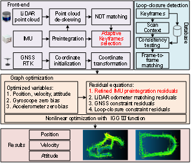

# GLIO_SLAM: (Beta version)

## Introduction

&emsp;&emsp;We introduce GLIO_SLAM, a high-performance inertial navigation system (gyroscope zero-bias less than Earth's rotation) multi-sensor fusion simultaneous localization and mapping (SLAM) system, suitable for ground vehicles. Our system features multi-sensor initialization, keyframe selection, refined pre-integration, SC loop detection, and robust localization and mapping in diverse environments. We achieve high-precision and reliable indoor and outdoor localization by integrating LiDAR, inertial measurements, and RTK results within a factor graph. To enhance the performance of GNSS, IMU, and LiDAR fusion localization, we design a two-step LiDAR keyframe selection strategy that considers the consistency of NDT registration, IMU pre-integration, Euler angle changes, and Euclidean distance, enabling adaptation to vehicle motion states and avoiding keyframe omissions during selection. To address the issue of insufficient accuracy in the backend IMU pre-integration algorithm, we propose an improved pre-integration model that considers Coriolis acceleration, Earth's gravity variation, and centripetal acceleration due to vehicle motion. The effectiveness of the proposed method was evaluated through a series of vehicle experiments.

&emsp;&emsp;The preprint version of paper is [here](http://arxiv.org/abs/xxxxx).
In the paper, we present the actual measurement dataset is at [**Navigation-dataset**](https://github.com/xdinav/Navigation-dataset), Open-source dataset is at [**UrbanNavDataset**](https://github.com/weisongwen/UrbanNavDataset).

Figure 1. GNSS/IMU/LiDAR fusion positioning framework. The two red fonts are the two improvements in this contribution.

# 1.Prerequisites and Installation

## 1.1 Ubuntu and ROS
- **operating system**: Ubuntu 18.04 (ROS Melodic) / 20.04 (ROS Noetic)
- **build tools**: CMake ≥ 3.10, GCC ≥ 7.5

## 1.2 Ceres (1.14)
~~~
git clone --branch 1.14.0 https://github.com/ceres-solver/ceres-solver.git
#If the network is poor, you can still access it https://bgithub.xyz
sudo apt-get update
sudo apt-get install liblapack-dev libsuitesparse-dev libcxsparse3 libgflags-dev libgoogle-glog-dev libgtest-dev
cd ceres-solver-1.14.0
mkdir build && cd build
cmake ..
make -j8
sudo make install
~~~

## 1.3 g2o
~~~
git clone https://github.com/RainerKuemmerle/g2o.git
sudo apt-get update
sudo apt-get install cmake libeigen3-dev libsuitesparse-dev qtdeclarative5-dev qt5-qmake libqglviewer-dev
cd g2o
mkdir build && cd build && sudo ldconfig
cmake ..
make -j4
sudo make install
~~~

## 1.4 Geographic
~~~
https://sourceforge.net/projects/geographiclib/
~~~
Download link is [here](https://jaist.dl.sourceforge.net/project/geographiclib/distrib-C%2B%2B/GeographicLib-2.5-win64.exe?viasf=1)
~~~
cd GeographicLib
mkdir build && cd build
cmake ..
make -j8
sudo make install
~~~

## 1.5 Gtsam (4.0.2)
~~~
https://github.com/borglab/gtsam/archive/4.0.2.zip
unzip gtsam-4.0.2.zip && cd gtsam-4.0.2.zip
mkdir build && cd build
cmake -DGTSAM_BUILD_WITH_MARCH_NATIVE=OFF ..
sudo make install
~~~

## 1.6 Eigen,Opencv and PCL
- ROS Melodic full version includes Eigen 3.3.4 and PCL 1.8 .

# 2.Build GLIO_SLAM
After install all 3rd parties：
~~~
mkdir -p ~/GLIO_SLAM_ws/src
cd ~/GLIO_SLAM_ws/src
git clone https://github.com/xdinav/algorithm-system.git
cd ../..
catkin_make -j8
~~~

# 3.Run examples

Download [Navigation-dataset](https://github.com/xdinav/Navigation-dataset.git) dataset and give a star.For detailed information on the data, please refer to the readme.

[launch] open a terminal and type:
~~~
source devel/setup.bash
roslaunch GLIO_SLAM lio_mapping.launch
~~~
[play rosbag]open forth terminal:
~~~
rosbag play zhengzhou.bag
rosbag play wuhan.bag
~~~
Download [UrbanNavDataset](https://github.com/weisongwen/UrbanNavDataset) dataset and give a star.
We use road data from March 14, 2020 for supplementary testing.
~~~
source devel/setup.bash
roslaunch GLIO_SLAM lio_mapping.launch
~~~
Tip: Modify the topic name of DataSretreatFlow:: DataSretreatFlow() in data_pretreate_flow.cpp
[play rosbag]open forth terminal:
~~~
rosbag play 2020*.bag
~~~

&emsp;&emsp;The open-source GLIO-SLAM (Beta version) mainly includes the fusion of satellite navigation, inertial navigation, and LiDAR. The backend optimization uses the g20 optimization library, and the specific open-source features include:
- Inertial pre integration refinement processing
- NDT front-end matching algorithm
- Nonlinear backend optimization
- Sensor data format interface
- RVIZ node display

&emsp; &emsp; This is an experimental beta version that we will continue to improve. We will gradually open source more sensor integrations in the future, including RGB/infrared cameras, solid-state LiDAR, high-precision maps, wheel speed sensors, and more.
The algorithm was hastily organized. If there are any shortcomings, please correct them!

